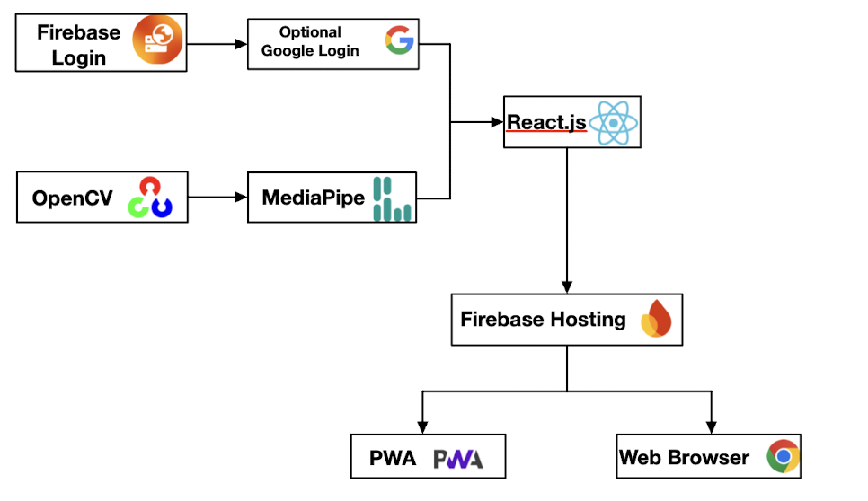
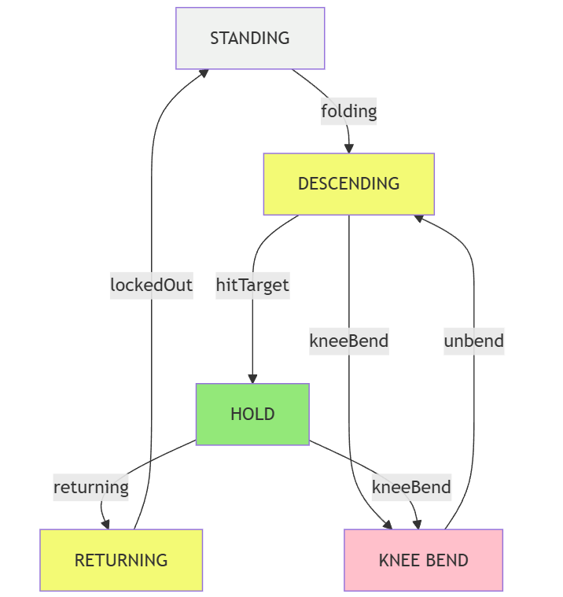

# ExerSights

AI-powered application for fitness & rehab, providing real-time feedback on exercise form using state of the art computer vision models. Track, correct, and improve your exercise form for safer, smarter, and more effective workouts.

## Engineering Addendum

This document is intended to help future developers understand the core architecture and get up to speed on the current state of the codebase. 

This project aims to develop a web application to assess physical therapy techniques and athletic movements with computer vision. Key concepts of this project are integrating human pose detection models with video data that can accurately, efficiently, and constantly identify the user's current body position, as well as provide real-time feedback and guidance for the user to maintain the correct form during different physical activities, based on physiological literature. Our application will feature a catalog of exercises that users can quickly navigate to select their desired exercise and immediately start making improvements simply by activating their device camera. With a successful implementation of the application, it will positively impact fitness, physical therapy, and rehabilitation by improving exercise safety and effectiveness.

### Usage

This section covers how users are intended to access and use the project. We provide a YouTube tutorial [here](https://www.youtube.com/embed/a-16RUDbfmk?si=B4F6Q1K2--eXx2Ke) and on the home page, but additonally provide a text version here. 

Users are required to use a laptop or mobile device with a camera. Users will open the app by navigating to https://exersights.web.app/ on a web browser. For mobile devices, if the user wishes to download and use the progressive web app, they must follow the browser instructions appearing at the bottom of the page during the initial entry. 

Users will perform the following steps once on the home page:
1. Navigate to the Catalog page. Make sure you are logged in if you would like to use some of the account-specific features such as exercise settings, workout programs, and pinned exercises.
2. Search for and select a desired exercise by clicking on the exercise card.
3. Once on the exercise page, observe the feedback panel on the right. Click on the help (?) button to open a modal containing a tutorial and camera placement instructions for that specific exercise. Click the ‘close’ button or anywhere off the modal once finished viewing.
4. Click on the settings (gear) button to open a modal containing various exercise settings specifications including custom angle targets (such as target depth for squat) and voice selection for audio feedback.
5. If you would like to upload a video, click on the “Upload Video” button on the feedback panel.
6. Perform the exercise live by using your device’s webcam (or play your uploaded video) and hit the “Start Feedback” button. Ensure that your entire body is in frame and begin the exercise, adjusting your form based on the feedback.
    - If you would like to switch to an external webcam which is different from your device’s default, use the dropdown next to the “Start Feedback” button.
    - If you would like to use the timer, set a duration on the feedback panel and click the “Start n-Second Timer” (where n is the number of seconds you input in the duration field; 30 seconds by default) button to begin.
7. At the end of the exercise, a summary pop-up will be displayed. If you are logged in, you will have the option to save this summary which can be viewed later in the “My ExerSights” page at the top right.

Users also have the ability to create personalized workouts by performing the following:
1. Make sure you are logged in, and navigate to the Program page.
2. Click the + icon to create a new workout.
3. Click the gear icon to edit existing workouts. This will open a modal where you can select an exercise from the dropdown and add/position it within the program. Click “Save” and “Close” to save your changes to the database and exit out of the modal.
4. Users can navigate to the FAQ page to see answers to frequently-asked questions and a form to submit requests for new exercises, feedback, or additional questions.

#### Operating Environment

- Crowded Environment: We do not advise using ExerSights in a crowded environment. While it is possible for the Mediapipe computer vision model to detect more than one person in the frame, we have limited control over the model and cannot guarantee that it will always detect the correct person performing the exercise. By default, ExerSights is programmed to assume only one person is in the frame. To avoid the model switching to another person, ensure that you are the only one in frame.
- Lighting/Background: To ensure the highest feedback accuracy, please perform exercises in a well-lit area where your body joints/limbs are discernible and visible to the camera. Also, make sure that there is a degree of contrast between you and the background. If you are wearing all blue clothes and your background is a blue wall, the model may have difficulty identifying your joint positions.
- Camera Placement: Each exercise has its own ideal camera placement, which ensures the highest accuracy of its feedback. For example, the squat exercise recommends users to position themselves so that the side of their body is facing the camera. Although it is possible to perform the exercise with the front of your body facing the camera, it will not be as accurate.
- Visibility of Joints/Limbs: In order to receive the most accurate feedback, please ensure that your entire body is visible to the camera. It is possible for the computer vision model to guess the position of non-visible joints, but this is often inaccurate and jittery. If your entire body is not in frame, the feedback panel will display the “Make sure all limbs are visible” error message as a warning.
- Cheating the Model: It is possible to cheat while doing many of the exercises, as our system takes into account a limited number of joint angles/positions to calculate feedback. For example, you can cheat the squat exercise by simply lifting your knee up to bend it beyond the target angle. We assume that all users are acting in good faith when using the app. Cheating the app is not advised as it disrupts your own workout efficacy. 


### Project Architecture

ExerSights is a web application built with three main technologies: React.js (React), MediaPipe Solutions, and Firebase. The web app can be accessed via a standard web browser or downloaded as a Progressive Web App (PWA) to use offline if desired.

- The entire frontend user interface of ExerSights is built with React, a popular JavaScript library known for its component-based architecture and efficient Virtual DOM rendering, which updates only necessary UI elements for improved responsiveness. We leverage the Material UI (MUI) component library, implementing Google’s Material Design with production-ready components like Button, Typography, and Card.

- ExerSights uses the WebRTC `getUserMedia` API for camera access or a file API for uploaded videos, feeding these to Google’s MediaPipe Solutions for real-time human pose detection with limb and joint landmarks. We employ MediaPipe's lightweight tasks-vision landmark detection model (which uses OpenCV, an open-source computer vision model) to minimize client-side compute and latency, receiving X-Y coordinates of detected landmarks for angle calculations to track user posture.

- ExerSights does not have a dedicated backend. Instead, ExerSights is a frontend-focused application with pose processing and exercise logic handled client-side in JavaScript to reduce latency. For user cloud features and hosting, we utilize Firebase, Google’s BaaS. Specifically, we use App Hosting for streamlined deployment via GitHub CI/CD, Authentication for easy Google sign-on, Cloud Firestore as our NoSQL database for intuitive user data storage and customization, and Analytics to monitor user activity and app performance.



### Development

When it comes to development, we work in this GitHub repository. The main branch is directly deployed to our URL. To maintain the integrity of our deployment, we established a CI/CD pipeline. Every new feature starts as a GitHub issue and is developed on a separate branch from main. Once the feature was ready, the developer submits a pull request (PR) and assigned reviewers. Each PR triggered the following automated GitHub Actions: a GitHub CodeQL scan for potential security vulnerabilities, and a Firebase preview deployment so reviewers could test the update without pulling or checking out the branch locally. Only once a PR passes all checks and reviews, do we then merge the branch into main. 

#### Set-up Instructions
1. Clone the repository
2. Set-up a `.gitignore` file. We provide an example [here](docs/gitignore-example.txt).
3. Create a `.env` file with necessary keys. We provide an example [here](docs/env-example.txt).
4. Run `npm install` to install necessary packages.
5. Run `npm start` to run a local deployment
6. Happy developing! 

#### Exercise Logic

With landmarks and location data of the user limbs provided by MediaPipe, our main challenge was to translate these different exercises into code. To do so, we decided to represent exercises as an finite state machine (FSM), where each exercise is broken down into different states and the triggers for transitions between states. The defined transitions often require a specific sequence of movements and reaching certain angular thresholds to progress through the different phases of the exercise and complete a valid repetition. We realized that most exercises can be reasonably defined with this FSM and would allow us to generalize pages to add many exercises easily.



Let's consider the Standing Toe Touch exercise, which, as illustrated, uses states like ‘DESCENDING,’ ‘FOLDING,’ ‘TOUCHING,’ and ‘RETURNING.’ A full repetition typically involves moving from the initial ‘STANDING’ state to the ‘DESCENDING’ state as the user begins to bend. To progress towards the toe touch, the user transitions to the ‘FOLDING’ state, bending further at the hips. The ‘TOUCHING’ state is reached when the user extends downwards to touch their toes or reach a target point. To complete the repetition, the user must then move through the ‘RETURNING’ state, gradually straightening back up until they reach the initial ‘STANDING’ state. This completes one full cycle. For instance, if a user has reached the ‘FOLDING’ state but doesn't extend downwards sufficiently to meet the criteria for the ‘TOUCHING’ state, they will not be able to transition directly back to the ‘RETURNING’ state. 

To represent this FSM, we use a JSON data structure. Our current exercise can be found in [this directory](/app/src/utils/exercises/). 

To add an exercise, developers can follow these steps:

1. Create a new exercise file in the [exercise directory](./path/to/exercises).
2. Define the FSM JSON for your exercise. Your FSM should include:

   | Field        | Purpose                                                              | Example                                |
   |--------------|----------------------------------------------------------------------|----------------------------------------|
   | `states`     | Defines feedback, color, and repetition behavior for each posture state | INIT, FOLDING, TOUCHING, etc.          |
   | `transitions`| Defines allowed state changes based on events                        | INIT ➔ FOLDING on `"folding"`          |
   | `jointInfo`  | Lists key joints and angles to monitor (based on landmark indices)   | hipAngle, kneeAngle, etc.              |
   | `conditions` | Describes what angle thresholds trigger which transitions            | hipAngle ≤ targetHipAngle ➔ `"hitTarget"` |
   | `targets`    | Sets the default angles you want the user to hit                     | e.g., `targetHipAngle = 75` degrees    |
   | `angleSetters` | Names of joint angles you want to continuously update during tracking | `setHipAngle`, `setKneeAngle`, etc.    |
   | `title`      | Display name for the exercise                                        | "Standing Toe Touch"                   |
   
   Try to use clear and reasonable names for the states, transitions, and angles.

3. Write a check function like the one shown below. This should be fairly straightforward once the exercise FSM JSON has been defined.
    ```
    export const checkYourExercise = (landmarks, onFeedbackUpdate, setColor, setCurrAngle1, setRepCount, yourTarget = 75) => {
        yourExerciseInfo.targets["targetAngleName"] = yourTarget;

        currState = genCheck(
            yourExerciseInfo,
            (...args) => getTransitionType(...args, yourExerciseInfo, currState),
            currState,
            landmarks,
            onFeedbackUpdate,
            setColor,
            setRepCount,
            { AngleName: setCurrAngle1 }
        );
    };
    ```

4. Find a suitable exercise image for the display and put in in [exercise-cards](/app/src/assets/exercise-cards/). Put a demonstration image for the ideal camera angle in [instructions](/app/src/assets/instructions/).

5. Register your exercise in [content.json](/app/src/assets/content.json) and [content.js](/app/src/assets/content.js). 


#### Development Advice

- When developing larger more complex features, we highly recommend developing a working prototype of the feature as quickly as possible. Especially for features that require API calls, getting those working can be complex and tedious in their own right (i.e. MediaPipe).
- We also recommend keeping the core architecture and code relatively simple when possible. We intentionally did not create a seperate backend, which streamlined not only development, but also the usage. 
- When it comes to software, clean and well-generalized code is always the ideal. However, this is not necessarliy always feasible so it is important to chose when and where you generalize your code. Specifically, components and pages that repeat several times should be generalized (exercise pages, feedback panel component, exercise settings pages)
- Beyond generalizing code, we also needed to generalize data for this project. It's important to standarize data you plan to parse often or save to the cloud. As an example, the distinction between the different exercise pages is the exercise JSON FSM described in the previous section. Similarly, our programs are also stored as a JSON.
- Thorough testing is always a must. Use `console.log` and your browser developer tools to detect and debug issues. Most previous can provide a heap snapshot to detect memory leaks as an example.
- As developers constantly working in trenches of a project, it can be hard to think outside the box to come up with new features, especially in regards to usability. We found that getting external feedback from Professor, friends, family, or even strangers is a great remedy to this issue.

### Project State

ExerSights is currently in a stable and functional state, with the core features of real-time exercise feedback, user accounts, workout programs, operating as intended and largely bug-free.

#### Current Features

- Real-time text, customizable audio, and customizable visual feedback for 10+ exercises
- Individual exercise personalization and exercise favoriting/pinning on Catalog
- Customizable programs to chain several exercises together into a Program
- Mobile-responsive site and Progressive Web App effective across all devices

### Future Features

- Add more exercises!
- Detecting 2 users in one camera feed.
- Alt text for buttons/other elements when highlighted
- Adding tags and categories to exercise (i.e. upper-body, lower-body)
- Allowing users to enable and disable feedback from a distance with some sort of audio or visual cue

### Non-critical Bug Fixes

- There is a buggy 'bubble' animation when exiting a page with the `esc` key somtimes.
- Stop feedback while another window is pulled up (settings or tutorial)
- Allow PWA to update upon internet access
- On mobile devices, audio feedback overrides the audio ding for a completed rep 

## References

### Bridge

-   https://www.mayoclinic.org/healthy-lifestyle/labor-and-delivery/multimedia/bridge-exercise/img-20006409#:~:text=Do%20the%20bridge%20to%20strengthen,Hold%20for%20three%20deep%20breaths
-   https://petersenpt.com/glute-bridge-benefits

### Squat

-   https://www.menshealth.com/fitness/a39110810/how-to-do-bodyweight-squats/
-   https://health.clevelandclinic.org/proper-squat-form

### Dead Bug

-   https://www.yorkvillesportsmed.com/blog/the-dead-bug-exercise-and-how-you-can-do-it-perfectly
-   https://www.healthline.com/health/exercise-fitness/dead-bug-exercise

### Push Up

-   https://www.menshealth.com/fitness/a26752486/perfect-push-up/
-   https://health.clevelandclinic.org/how-to-do-a-push-up

### Pull Up

-   https://www.webmd.com/fitness-exercise/how-to-do-pull-ups
-   https://www.healthline.com/health/pull-ups

### Muscle Up

-   https://www.menshealth.com/uk/building-muscle/a25991719/how-to-do-first-muscle-up-an-experts-guide/
-   https://gripped.com/indoor-climbing/how-to-do-a-muscle-up/

### Lateral External Rotation

-   https://www.youtube.com/watch?v=EUMsYC_W3aI
-   https://www.muscleandfitness.com/exercise/workouts/shoulder-exercises/90-degree-cable-external-rotation/

### Plank

-   https://www.menshealth.com/fitness/a25628831/plank-exercise/
-   https://health.clevelandclinic.org/plank-exercise-benefits

### Pilates Hundred

-   https://www.powerpilates.com/encyclopedia/?a=42#:~:text=Arms%20pump%20vigorously%2C%20lifting%20up,while%20sitting%20in%20a%20chair.
-   https://www.verywellfit.com/how-to-do-the-pilates-hundred-2704677

### Lunge

-   https://www.mayoclinic.org/healthy-lifestyle/fitness/multimedia/lunge/vid-20084662
-   https://www.onepeloton.com/blog/how-to-do-lunges

### Leg Raise

-   https://workoutlabs.com/exercise-guide/lying-leg-raises/#:~:text=Lie%20on%20your%20back%20on,Return%20to%20starting%20position.
-   https://www.muscleandstrength.com/exercises/lying-floor-leg-raise.html

### Toe Touch

-   https://www.youtube.com/watch?v=Xvr5N_Xf6QM
-   https://www.healthline.com/nutrition/how-to-touch-your-toes

### Standing Oblique Crunch

-   https://liftmanual.com/standing-side-crunch/
-   https://www.spotebi.com/exercise-guide/standing-side-crunch/

### Tree Pose

-   https://www.yogajournal.com/poses/tree-pose-2/
-   https://www.verywellfit.com/tree-pose-vrksasana-3567128

### Shoulder Press

-   https://ericrobertsfitness.com/how-to-do-dumbbell-shoulder-press-the-correct-guide/
-   https://www.muscleandstrength.com/exercises/seated-dumbbell-press.html
